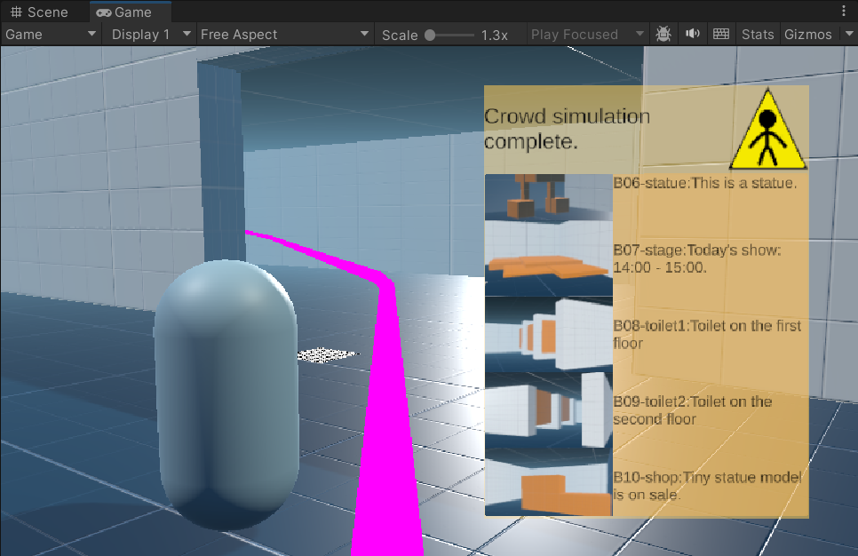

AR Indoor Navigation
=====
Neoscholar - 2023 Summer - CIS research program: AR Indoor Navigation

# Team members
Jerry Wang(Canhao Wang):
* Whole design of the demo.
* Models (museum and exhibits) in the scene and data (.xlsx, pics, mp3) in the server.
* Part of the scripts:
  * User Interface and detail trigger sensors.
  * Refine the Python server and add new APIs (/details and /sensor_init).
* Design and Implement sections of the report.

James Yu(Kaijia Yu):
* Part of the Unity scripts:
  * Blockers and human model generator.
  * Path finding algorithm with Unity Nav Mesh.
* Explanation for relevant algorithms in the Implement section of the report. 

Shirley Xu(Manshu Xu):
* Analysis for most of the related works.
* Basic implementation of the Python server (/loinfo and /random_people).
* All the other sections of the report.
* Paper work(organizng all the sections into a complete report with LaTeX).

# Introduction
We propose an AR indoor navigation solution. Based on camera indoor positioning, navigation achieves better performance with fewer markers. We create a Unity demo and a Python server to demonstrate our design. 

We focus on enhancing user experience, making the solution more effective in large indoor environments like shopping malls and museums. Dynamic obstacles such as gates and other visitors are simulated in the demo to evaluate navigation performance. We also implement voice input for a more convenient input method on real AR devices. The image below shows the UI and the navigation line of our system.

# How to use this repository
The `main` branch contains two versions of our demo. It is recommended to download the `Latest Version` branch, which contains the final version of our demo only.

The `Previous Version` branch serves as a backup for the first valid demo.

# How the demo work
* Open the demo with Unity (the editor version for the demo is 2022.3.5f1).
* Run the server in Assets/_OurAssets/server/APP.py
* Press `Play` in the editor and start the demo.

Note: Detailed guidance can be found in `Guide.pdf`.
